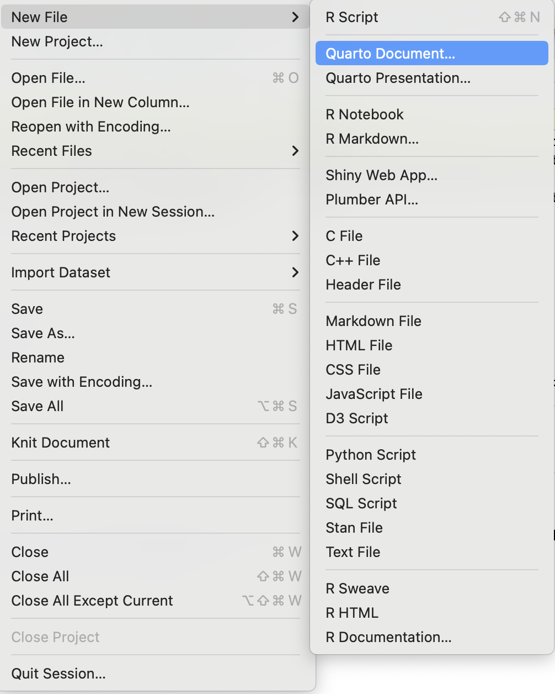
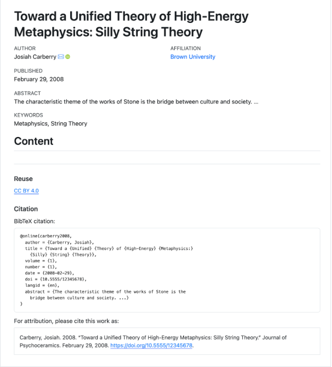
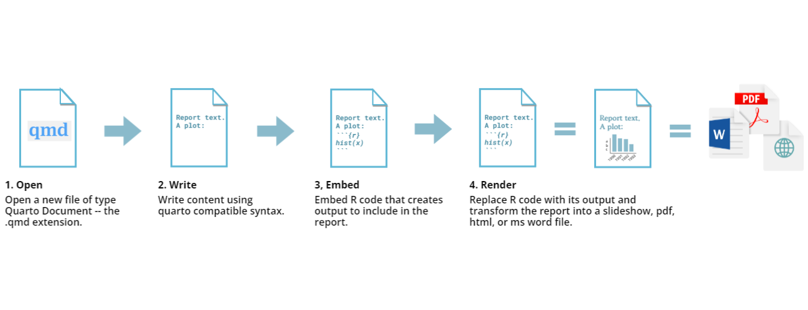
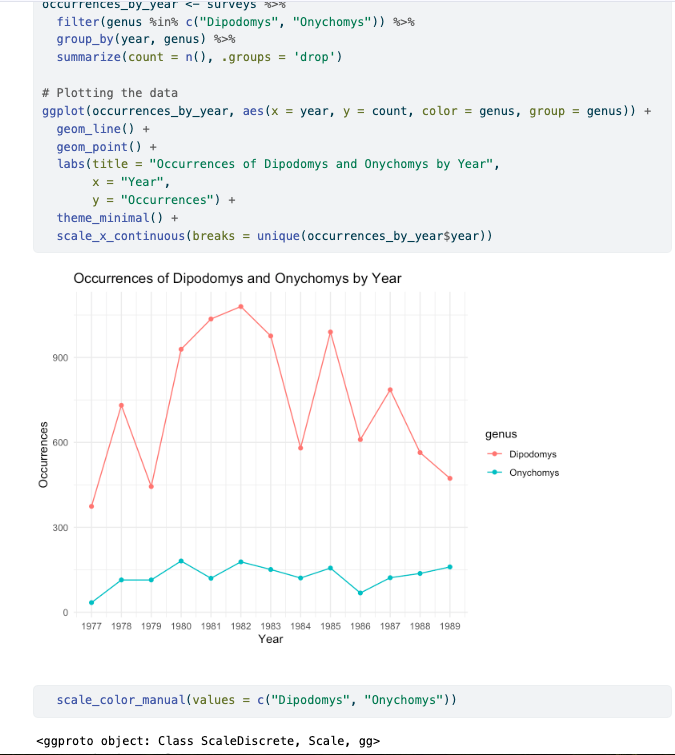

::: instructor
-   This is an optional lesson intended to introduce learners to Quarto.
-   While it is listed after the core lessons, some instructors may prefer to teach it early in the workshop, depending on the audience.
:::

::: objectives
-   Create a .qmd document containing R code, text, and plots
-   Create a YAML header to control the output
-   Understand the basic syntax of Quarto
-   Customize code chunks to control formatting
-   Use code chunks and in-line code to create dynamic, reproducible documents
:::

::: questions
-   What is Quarto?
-   How can I integrate my R code with text and plots?
-   How can I convert .qmd files to .html?
:::

## Quarto

Quarto is an open-source scientific and technical publishing system for integrating code, text, figures, citations, etc., to produce elegantly formatted output as documents, web pages, blog posts, books and more.

If you've heard of or used R Markdown, Quarto is closely related to it, but with the advantage of supporting multi-language projects, more built-in output formats, and options for customizing and creating dynamic content natively in RStudio instead of relying on external packages.

Quarto allows you to produce research reports with minimal reproducibility friction. It provides an environment where you can write your complete analysis. It weaves your text, figures, code, and citations into a single document. The following sections cover examples of using Quarto to explore data with collaborators and communicate your science. Documents created with Quarto can be readily converted to multiple static and dynamic output formats, including PDF (.pdf), Word (.docx), and HTML (.html).

Quarto comes pre-installed with your RStudio IDE (v2022.07 and later), so there's no need for anything before we can move on.

## Creating a Quarto file

To create a new Quarto document in RStudio, click File -\> New File -\> Quarto Document:

{alt="Screenshot of the New Quarto file dialogue box in RStudio"}

Then click on 'Create Empty Document'. Typically, you could enter the title of your document, your name (Author), and select the type of output, but we will learn how to start from a blank document.

## Basic components of Quarto

To control the output, a YAML (YAML Ain't Markup Language) header is needed:

```         
---
title: "Untitled"
format: html
editor: visual
---
```

The header is defined by the three hyphens at the beginning (`---`) and the three hyphens at the end (`---`).

In the YAML, the only required field is the `format:`, which specifies the type of output you want. This can be an `html`, a `pdf`, or a `word`. We will start with an HTML document and discuss the other options later.

After the header, to begin the body of the document, you start typing after the end of the YAML header (i.e., after the second `---`).

While we will stick to the basics, it is important to note that Quarto provides a rich set of YAML metadata keys to describe front-matter details and configuration settings to customize how your document will render. Even though we won't be able to cover those today, here is an example that can inspire you to explore it further:

```         
---
title: "Toward a Unified Theory of High-Energy Metaphysics: Silly String Theory"
date: 2008-02-29
author:
  - name: Josiah Carberry
    id: jc
    orcid: 0000-0002-1825-0097
    email: josiah@psychoceramics.org
    affiliation: 
      - name: Brown University
        city: Providence
        state: RI
        url: www.brown.edu
abstract: > 
  The characteristic theme of the works of Stone is 
  the bridge between culture and society. ...
keywords:
  - Metaphysics
  - String Theory
license: "CC BY"
copyright: 
  holder: Josiah Carberry
  year: 2008
citation: 
  container-title: Journal of Psychoceramics
  volume: 1
  issue: 1
  doi: 10.5555/12345678
funding: "The author received no specific funding for this work."
---
```

The image below shows how this Quarto document would look as an html output:

{alt="Screenshot of a Custom YAML HTML document"}

## Markdown syntax

Even though RStudio supports the visual mode, with which you can accomplish most formatting without syntax typing, it is worth understanding its basics.

Markdown is a popular markup language that allows you to add formatting elements to text, such as **bold**, *italics*, and `code`. The formatting will not be immediately visible in a markdown (.md) document like in Word. Instead, you add Markdown syntax to the text, which can then be converted to various other files that can translate the Markdown syntax. Markdown is helpful because it is lightweight, flexible, and platform-independent.

First, let's create a heading! A `#` in front of the text indicates to Markdown that this text is a heading. Adding more `#`s make the heading smaller, i.e., one `#` is a first-level heading, two `##`s is a second-level heading, etc., up to the 6th level heading.

```         
# Title
## Section
### Sub-section
#### Sub-sub section
##### Sub-sub-sub section
###### Sub-sub-sub-sub section
```

Ensure only to use a level if the one above is also in use.

Since we have already defined our title in the YAML header, we will use a section heading to create an Introduction section.

```         
## Introduction
```

You can make things **bold** by surrounding the word with a double asterisks, `**bold**`, or double underscores, `__bold__`; and *italicize* using single asterisks, `*italics*`, or single underscores, `_italics_`.

You can also combine **bold** and *italics* to write something ***really*** important with triple-asterisks, `***really***`, or underscores, `___really___`; and, if you're feeling bold (pun intended), you can also use a combination of asterisks and underscores, `**_really_**`, ***really***.

To create `code-type` font, surround the word with backticks, `` `code-type` ``.

Now that we've learned a couple of things, it might be useful to implement them:

```         
## Introduction

This report uses the **tidyverse** package along with the *surveys_complete_77_89.csv* dataset, 
which has columns that include:
```

Then, we can create a list of the variables using the `-`, `+`, or `*` keys.

```         
## Introduction

This report uses the **tidyverse** package along with the *surveys_complete_77_89.csv* dataset, 
which has columns that include:

- record_id
- month
- day
- year
- plot_id
- species_id
```

You can also create an ordered list using numbers:

```         
1. record_id
2. month
3. day
4. year
5. plot_id
6. species_id
```

And nested items by tab-indenting:

```         
- record_id
  + unique case number
- month
  + month case was recorded
- day
  + month case was recorded
- year
  + year was recorded
- plot_id
  + unique plot ID
- species_id
  + species alpha code
```

For more Markdown syntax, see [the following reference guide](https://quarto.org/docs/authoring/markdown-basics.html).

Now we can render the document into HTML by clicking the **Render** button at the top of the Source pane (top left), or use the keyboard shortcut <kbd>Ctrl</kbd>+<kbd>Shift</kbd>+<kbd>K</kbd> on Windows and Linux, and <kbd>Cmd</kbd>+<kbd>Shift</kbd>+<kbd>K</kbd> on Mac. If you haven't saved the document yet, you will be prompted to do so when you **Render** for the first time.

{alt="The 'rendering' process"}

## Writing a Quarto report

Now, we will add some R code from previous episodes, meaning we need to ensure **ggplot2** and **dplyr** are loaded. It is not enough to load **tidyverse** from the console, we will need to load it within our Quarto document. The same applies to our data. To load these, we will need to create a 'code chunk' at the top of our document (below the YAML header).

A code chunk can be inserted by clicking Code \> Insert Chunk, or by using the keyboard shortcuts <kbd>Ctrl</kbd>+<kbd>Alt</kbd>+<kbd>I</kbd> on Windows and Linux, and <kbd>Cmd</kbd>+<kbd>Option</kbd>+<kbd>I</kbd> on Mac.

The syntax of a code chunk is:

````{verbatim, lang = "markdown"}
```{r}

"Here is where you place the R code you want to run."

```
````

In Quarto, you can label a code chunk by adding a label:

````{verbatim, lang = "markdown"}
```{r}
#| label: testing

"Here is where you place the R code you want to run."

```
````

A Quarto document knows that this text is not part of the report from the ```` ``` ```` that begins and ends the chunk. It also knows that the code inside of the chunk is R code from the `r` inside of the curly braces (`{}`). After the `r`, you can add a name for the code chunk. As mentioned, Quarto is multi-language, and you may enter other programming languages for specific code chunks if desired. However, this workshop focuses on R, so let's stick to that.

Naming a chunk is optional but recommended for easier referencing and future updates. Please keep in mind that each chunk name must be unique and can only include alphanumeric characters and hyphens (-).

To load **ggplot2** and **dplyr** and our `surveys_complete_77_89.csv` file, we will insert a chunk and call it 'genus-comp'.

```{r really-running, echo=FALSE, message=FALSE, purl=FALSE}
library(tidyverse)
surveys <- read_csv("data/cleaned/surveys.csv")
```

````{verbatim, lang = "markdown"}
```{r}
#| label: genus-comp
# Load necessary packages
library(tidyverse)

# Load the dataset
surveys <- read_csv("data/cleaned/surveys.csv")

# Count occurrences of Dipodomys and Onychomys by year
occurrences_by_year <- surveys %>%
  filter(genus %in% c("Dipodomys", "Onychomys")) %>%
  group_by(year, genus) %>%
  summarize(count = n(), .groups = 'drop')

# Plotting the data
ggplot(occurrences_by_year, aes(x = year, y = count, color = genus, group = genus)) +
  geom_line() +
  geom_point() +
  labs(title = "Dipodomys vs. Onychomys by Year",
       x = "Year",
       y = "Occurrences") +
  theme_minimal() +
  scale_x_continuous(breaks = unique(occurrences_by_year$year))

```
````

You don’t need to **Render** your entire document whenever you want to view how the code you are currently working on is rendering. While this might not be an issue for shorter documents, it can be time-consuming with many code chunks when you want to check the output of a specific block. In such cases, you can run the code chunk by clicking the green triangle in the top right corner or by using the keyboard shortcuts: <kbd>Ctrl</kbd>+<kbd>Alt</kbd>+<kbd>C</kbd> on Windows and Linux, or <kbd>Cmd</kbd>+<kbd>Option</kbd>+<kbd>C</kbd> on Mac.

Run the code chunk to make sure you get the desired output.

{alt="Genus Comparision Rendered Plot Example"}

We generated a rendered plot, but it includes many unnecessary elements that we may not want in our report. Let’s explore how we can enhance it.

## More on customizing chunk outputs

There are several code and cell output options that you can use to customize how things will look in your rendered .qmd document. Below are a few of the most commonly used:

| Option    | Options                              | Output                                                                                                                                                |
|------------------|------------------|-----------------------------------|
| `eval`    | `TRUE` or `FALSE`                    | Whether or not the code within the code chunk should be run.                                                                                          |
| `echo`    | `TRUE` or `FALSE`                    | Choose to show your code chunk in the output document. `echo = TRUE` will show the code chunk.                                                        |
| `include` | `TRUE` or `FALSE`                    | Choose if the output of a code chunk should be included in the document. `FALSE` means that your code will run, but will not show up in the document. |
| `warning` | `TRUE` or `FALSE`                    | Whether or not you want your output document to display potential warning messages produced by your code.                                             |
| `message` | `TRUE` or `FALSE`                    | Whether or not you want your output document to display potential messages produced by your code.                                                     |
| `results` | `markup`, `asis`, `HOLD`, or `FALSE` | How to display text results. Note that this option only applies to normal text output (not warnings, messages, or errors).                            |

Explore these and other options [Code Cells: Knitr](https://quarto.org/docs/reference/cells/cells-knitr.html#overview)

::: callout
## More about custom code chunks

-   The default settings for the above chunk options are all `TRUE`.
-   The default settings can be modified per chunk, or across the whole .qmd document using the [execution options](https://quarto.org/docs/computations/execution-options.html) at the YAML level.
-   There is also an option to apply global options to all .qmd files contained in a [quarto project](https://quarto.org/docs/projects/quarto-projects.html) using the `_quarto.yml` file configuration. But that is an advanced setup, and we encourage you to explore it with more time.
:::

::: challenge
## Exercise

Which option would I need to apply to the \`genus-comp\` example to not render the extra content from the plot?

::: solution
## Solution

#\| echo: FALSE

#\| warning: FALSE

#\| message: FALSE

#\| results: FALSE
:::
:::

::: challenge
## Exercise

Copy the code in the R script used to generate the blue graph in early episodes below. Create a code chunk in your .qmd document, and play around with the different options in the chunk with the code for the table, and **Render** the document or the code chunk to see what each option does to the output.

What happens if you use `eval = FALSE` and `echo = FALSE`? What is the difference between this and `include = FALSE`?

``` r
ggplot(data = complete_old, mapping = aes(x = weight, y = hindfoot_length)) +
  geom_point(alpha = 0.2, color = "blue")`
```

::: solution
## Solution

Create a chunk with `{r eval = FALSE, echo = FALSE}`, then create another chunk with `{r include = FALSE}` to compare. `eval = FALSE` and `echo = FALSE` will neither run the code in the chunk nor show the code in the rendered document. The code chunk doesn't exist in the rendered document, as it was never run. On the other hand, `include = FALSE` will run the code and store the output for later use.
:::
:::

## In-line R code

We've discussed code chunks and how to include them in a QMD document, but what if you want to integrate inline R code to present descriptive statistics in your paper? Using inline code can enhance your narrative by allowing dynamic values to appear alongside your text. Instead of manually typing static values, you can call them directly from your dataset. If your data changes, the values will automatically update, ensuring your results are always current.

To use in-line R-code, we use the same backticks that we used in the Markdown section, with an `r` to specify that we are generating R-code. The difference between in-line code and a code chunk is the number of backticks. In-line R code uses one backtick (`` `r` ``), whereas code chunks use three backticks (```` ```r``` ````).

The best way to use in-line R code, is to minimize the amount of code you need to produce the in-line output by preparing the output in code chunks. Let's say we're interested in presenting our dataset's average number of rodents.

Now, we can make an informative statement as an in-line R-code. For example:

Our dataset includes `` `{r} nrow(surveys)` `` cases.

becomes...

Our dataset includes `16878` cases.

Because we are using in-line R code instead of the actual values, we have created a dynamic document that will automatically update if we change the dataset and/or code chunks. Cool, right?

::: challenge
## Exercise

Create an in-line code to represent the average weight for the sample:

"Our sample includes `16878` cases, with an average hindfoot length of `?`

::: solution
## Solution

..., with an average weight weight of `` `{r} mean(as.integer(surveys$hindfoot_length), na.rm = TRUE)` `` millimeters.

becomes...

..., with an average hindfoot length of `r mean(as.integer(surveys$hindfoot_length), na.rm = TRUE)` millimeters.

If you feel inspired, you may also round it up `r round(mean(as.integer(surveys$hindfoot_length), na.rm = TRUE), 2)`

..., with an average weight weight of `` `{r} round(mean(as.integer(surveys$hindfoot_length), na.rm = TRUE)` `` millimeters.

becomes...

..., with an average hindfoot length of `r round(mean(as.integer(surveys$hindfoot_length), na.rm = TRUE), 2)`
:::
:::

## Other output options

You can convert Quarto to other formats. Quarto documents are currently supported as HTML (html), PDF (pdf), MS Word (docx), OpenOffice (odt) and ePub (epub). You may describe the desired output in the YAML.

```         
---
title: "My Awesome Report"
author: "Your name"
output: docx
---
```

Alternatively, you can specify the use of a format on the command line:

``` bash
quarto render document.qmd --to docx
```

::: callout
## Note: Creating PDF documents

In order to create PDFs you will need to install a recent distribution of TeX. We recommend the use of TinyTeX (which is based on TexLive), which you can install with the following command in the terminal:

``` bash
quarto install tinytex
```
:::

::: callout
## Note: Inserting citations into a Quarto file

It is possible to insert citations into a Quarto file using the editor toolbar. The editor toolbar includes formatting buttons commonly seen in text editors (e.g., bold and italic). The toolbar is accessible by using the settings drop-down menu (next to the 'Render' drop-down menu) to select 'Use Visual Editor', which is also accessible through the shortcut 'Crtl+Shift+F4'. From here, click 'Insert' allows 'Citation' to be selected (shortcut: 'Crtl+Shift+F8'). For example, searching '10.1007/978-3-319-24277-4' in 'From DOI' and inserting will provide the citation for `ggplot2` [@wickham2016]. This will also save the citation(s) in 'references.bib' in the current working directory. Visit the [R Studio website](https://rstudio.github.io/visual-markdown-editing/) for more information. Tip: You may also change citation styles automatically (see: <https://quarto.org/docs/authoring/citations.html>).
:::

## Resources

-   [Markdown Basics](https://quarto.org/docs/authoring/markdown-basics.html)
-   [Introduction to Reproducible Publications with RStudio](https://carpentries-incubator.github.io/reproducible-publications-quarto)

::: keypoints
-   Quarto is useful for creating reproducible documents combining text, code and figures.
-   Specify chunk options to control the formatting of the output document.
:::
